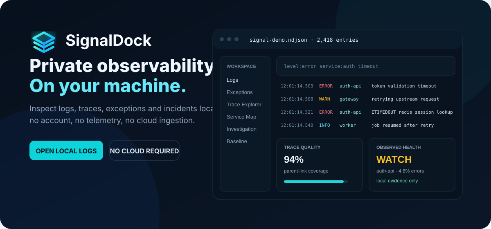
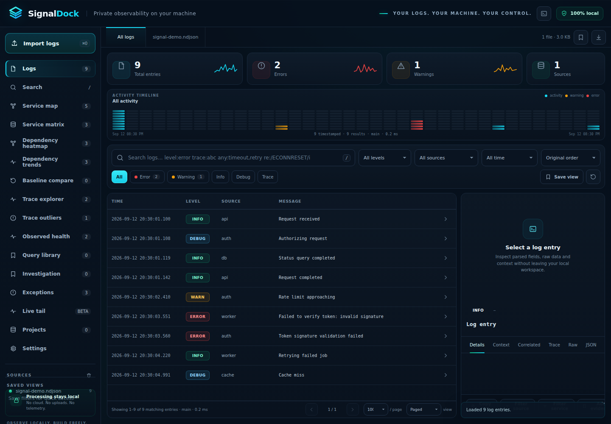
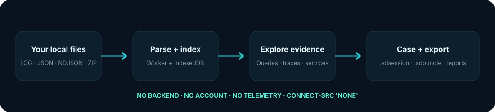

<div align="center">
  
  <h1>SignalDock</h1>
  <p><strong>Private observability on your machine.</strong></p>
  <p>Inspect logs, traces, exceptions and incidents locally — without shipping your data to somebody else's cloud.</p>

  <p>
    <a href="https://github.com/bren-wp/SignalDock/actions/workflows/ci.yml"></a>
    <a href="https://github.com/bren-wp/SignalDock/actions/workflows/codeql.yml"></a>
    
    
    
    
    
  </p>

  <p>
    <a href="https://github.com/bren-wp/SignalDock/archive/refs/heads/main.zip"><strong>Download ZIP</strong></a>
    ·
    <a href="#quick-start"><strong>Quick start</strong></a>
    ·
    <a href="./docs/TECHNICAL.md"><strong>Technical reference</strong></a>
  </p>
</div>

<p align="center">
  
</p>

<p align="center">
  <strong>SignalDock v2.8.19 — real application UI with the bundled demo dataset</strong><br>
  
</p>

## Your logs should not need a cloud account

SignalDock is a **local-first observability and investigation workspace** for developers, operators and security-minded teams. Drop in your logs, search them with structured queries, follow correlations, inspect distributed traces, group recurring exceptions, compare service behavior and build an investigation case — all inside your browser profile.

There is **no SignalDock backend**, no sign-up flow, no telemetry pipeline and no cloud ingestion service hiding behind the UI. Runtime network connections are disabled by the application's Content Security Policy.

<table>
<tr>
<td width="25%" align="center"><br><strong>Local-first</strong><br><sub>Your log contents stay on your machine.</sub></td>
<td width="25%" align="center"><br><strong>Fast investigation</strong><br><sub>Smart queries, worker filtering and local indexes.</sub></td>
<td width="25%" align="center"><br><strong>Trace intelligence</strong><br><sub>Service maps, trace explorer, flame view and dependency analysis.</sub></td>
<td width="25%" align="center"><br><strong>Case workflow</strong><br><sub>Evidence, findings, milestones, bundles and checkpoints.</sub></td>
</tr>
</table>

## What you can do with SignalDock

### 🔎 Search logs without giving them away

Open `.log`, `.txt`, `.json`, `.jsonl`, `.ndjson` and `.zip` files directly. SignalDock recognizes common JSON/ECS structures, Docker output, Apache/Nginx access logs, syslog, logfmt, multiline traces, CEF security events and standard OTLP JSON exports.

Use a compact smart-query language instead of fighting raw text:

```text
level:error service:auth timeout
trace:4bf92f3577b34da6
job:job-77 service:worker
message~:/token.*expired/i
has:exception env:production
before:2026-09-12T18:00:00 any:timeout,retry,failed
```

### 🧭 Understand distributed traces

SignalDock extracts trace, span, request, correlation, job, session and user identifiers where present. It can build service relationships from **explicit parent-span links**, show trace quality, render waterfall/flame views and compare trace behavior without inventing missing topology.

### ⚠️ Find recurring failures

Exception-like entries receive a deterministic local fingerprint, allowing repeated failures to be grouped and filtered. Trend views compare observed windows and can highlight rising or falling groups without pretending to be predictive AI.

### 🧪 Investigate, preserve context, hand it off

Pin important records as evidence, add notes and tags, create findings, milestones and checkpoints, then export the investigation as local JSON, Markdown or a self-contained `.sdbundle`. Portable `.sdsession` files preserve a full analysis workspace.

### 📊 Compare systems and deployments

Capture aggregate-only `.sdbaseline` snapshots and compare service, dependency and trace-set behavior against another dataset. Raw log records are **not embedded** in baseline files.

<p align="center">
  
</p>

## Built for real debugging workflows

SignalDock includes:

- multi-file drag-and-drop import
- streaming parsing for large text/NDJSON inputs
- worker-side filtering and a bounded local 3-gram candidate index
- bucketed IndexedDB search-cache restore for compatible large datasets
- environment and namespace dimensions
- Service Map, Service Matrix, Dependency Heatmap and Dependency Trends
- Trace Explorer, Trace Compare, Trace Outliers, critical-chain and flame views
- Observed Health summaries derived strictly from loaded evidence
- Case & Investigation workspace with evidence, findings, milestones and activity history
- reusable Query Library with folders and favorites
- feature-level Query Library controller under `src/app/` with explicit state/callback boundaries and no bundler dependency
- feature-level Baseline controller under `src/app/` with explicit Project/filters/autosave callbacks and preserved aggregate-only baseline semantics
- feature-level Project controller under `src/app/` that owns project UI/reopen orchestration while retaining the narrow desktop capability facade and portable-export stripping rules
- feature-level Recovery + Diagnostics controller under `src/app/` that owns recovery banner state, autosave orchestration, diagnostics rendering and support-copy UI while persistence/search-cache/browser capabilities remain root-injected callbacks
- feature-level Saved Views controller under `src/app/` that owns legacy quick-view creation/render/apply/delete UI while local persistence, prompt/ID generation and filter execution remain root-injected callbacks
- feature-level Import + Live Tail controller under `src/app/` that owns file-input/drag-drop orchestration, parsed-entry append state and local tail lifecycle while parser, File System Access and Project Manager capabilities remain root-injected callbacks
- feature-level Investigation controller under `src/app/` that owns evidence UI, local investigation import/export, Case Activity and Unified Timeline coordination through explicit callbacks
- feature-level Exception controller under `src/app/` that owns recurring-failure rendering, fingerprint filtering and representative-sample actions while exception grouping/trend analysis remains in `src/analysis/`
- feature-level Trace Explorer controller under `src/app/` that owns distributed-trace inventory, A/B comparison selection and trace-sample navigation while trace aggregation/comparison remains in `src/analysis/`
- feature-level Trace Outliers controller under `src/app/` that owns outlier result rendering, filtered-scope semantics and trace navigation while robust scoring remains in `src/analysis/trace-outliers.js`
- feature-level Service Matrix controller under `src/app/` that owns dependency-matrix rendering, filtered-scope semantics and service-filter actions while aggregation remains in `src/analysis/service-matrix.js`
- feature-level Dependency Heatmap controller under `src/app/` that owns time-bucket heatmap rendering, filtered-scope semantics and service-filter actions while bucketing remains in `src/analysis/service-heatmap.js`
- feature-level Case Checkpoint controller under `src/app/` that owns checkpoint rendering/actions while the bounded checkpoint model remains in `src/investigation/`
- feature-level Case Workspace controller under `src/app/` that owns findings, milestones and metadata-only attachment UI coordination while case normalization/persistence rules stay in `src/investigation/`
- local Project Manager and cross-dataset baseline comparison
- bounded multi-baseline history with saved-baseline A/B comparison and project association
- Project Manager recent workspace/dataset/baseline/case history, duplicate and archive controls
- Query Library multi-select bulk move/favorite/export/delete actions plus local usage ordering
- richer Case Checkpoint change summaries across metadata, findings, milestones, attachments and evidence
- bounded Trace Explorer result windows with exact global trace counts and lower parent-link memory overhead
- bounded Service Matrix latency aggregation that switches from exact samples to compact histograms on high-volume edges
- local File System Access handle registry foundation for project dataset/workspace reopening without uploading file contents
- real Project Reopen workflow with link/load, relink, permission recovery, reopen counters and capability cleanup
- streamed workspace writes through the local storage adapter, with recent-workspace metadata recorded only after a successful save
- narrow `src/platform/desktop-bridge.js` capability facade that keeps browser mode first-class while defining an explicit future native-shell contract
- dialog focus management, keyboard focus trapping, coarse-pointer touch targets and reduced-motion hardening
- crash/restart recovery snapshots in IndexedDB
- local Live Tail in browsers that support local file-follow access
- virtual/windowed result rendering for large result sets
- `Ctrl/Cmd + K` command palette
- JSON and NDJSON exports
- local parser profiles and a bundled parser-plugin registry

For the complete implementation notes, limits and data-model details, see **[docs/TECHNICAL.md](./docs/TECHNICAL.md)**.

## Quick start

SignalDock has **no build step and no package install requirement**.

```bash
git clone https://github.com/bren-wp/SignalDock.git
cd SignalDock
python3 -m http.server 8080
```

Then open:

```text
http://localhost:8080/
```

> You can also open `index.html` directly, but serving SignalDock over local HTTP enables the background Web Worker path and gives the browser a more complete feature environment.

Try the included datasets from `sample/`:

```text
sample/signal-demo.log
sample/signal-demo.ndjson
sample/signal-security.log
sample/otel-export.json
```

## Privacy is architecture, not a checkbox

| Property | SignalDock |
|---|---|
| Account required | **No** |
| Backend required | **No** |
| Telemetry / analytics | **None** |
| Cloud log ingestion | **None** |
| Runtime CDN dependencies | **None** |
| Runtime network primitives | **Disabled** |
| Content Security Policy | `connect-src 'none'` |
| Saved views / projects | Local browser storage |
| Recovery / search cache | Local IndexedDB, user-clearable |
| Portable workspace | Local `.sdsession` file |

Some optional local recovery/index features can contain normalized log-derived data inside the browser profile. They never become a remote SignalDock service and can be cleared by the user.

## Supported input families

| Family | Examples |
|---|---|
| Structured | JSON, JSONL, NDJSON, ECS-style fields |
| Tracing | Standard OTLP JSON, trace/span IDs, span events |
| Containers | Docker-style JSON logs |
| Web servers | Apache / Nginx access logs |
| Systems | syslog, logfmt, multiline stack traces |
| Security | CEF (Common Event Format) |
| Custom | Named-group regular-expression parser profiles |
| Archives | Local ZIP extraction with safety limits |

## No black-box claims

SignalDock deliberately distinguishes **observed evidence** from things it cannot prove. “Observed Health” is not uptime. “Trace outlier” is not root cause. “Regression” labels are deterministic comparisons of measured local data, not statistical significance claims. Missing parent spans are reported as missing instead of silently inferred.

That design principle matters when logs are being used to make production decisions.

## Project structure

```text
SignalDock/
├── index.html                 # public application shell
├── app.js                     # application orchestration entrypoint
├── filter-worker.js           # background worker entrypoint
├── styles.css                 # application styles
├── src/
│   ├── core/                  # parsing, query/search, workspace and persistence
│   ├── analysis/              # trace, service, span and exception analysis
│   ├── investigation/         # projects, baselines, cases and evidence workflows
│   ├── platform/              # browser/native storage capability boundary
│   ├── ui/                    # reusable UI and accessibility behavior
│   └── vendor/                # bundled local-only vendor runtime
├── assets/                    # local logo, favicon and icon sprite
├── sample/                    # safe example datasets
├── tests/                     # Node-based regression suite
├── website/                   # static product landing page
└── docs/                      # technical and architecture documentation
```

See **[docs/SOURCE-LAYOUT.md](./docs/SOURCE-LAYOUT.md)** for module-placement rules and quality-gate expectations.

## Development & tests

No dependency installation is required for the current test suite.

```bash
# syntax-check all runtime modules recursively
find . -type f -name '*.js' -not -path './.git/*' -print0 | xargs -0 -n1 node --check

# run all regression tests
for test in tests/*.mjs; do
  TERM=xterm node "$test" || exit 1
done
```

The GitHub Actions workflow runs the same quality gate on pushes and pull requests.

## Contributing

Bug reports, parser improvements and carefully scoped features are welcome. Start with **[CONTRIBUTING.md](./CONTRIBUTING.md)** and keep the core product principles intact: local-first processing, explicit evidence, bounded resource use and no hidden network dependency.

For security-sensitive reports, see **[SECURITY.md](./SECURITY.md)**.

## Roadmap

Near-term work is aimed at making SignalDock an even stronger local desktop-grade observability workspace:

- native desktop-shell adapter implementation over the documented local storage/filesystem boundary
- richer project-level dataset reopening once persistent filesystem handles are available
- deeper checkpoint-to-checkpoint comparison and optional user-authored checkpoint notes
- deeper filesystem/project adapters
- continued performance work for very large datasets
- groundwork for native Windows, macOS and Linux packaging

Native installers are **not shipped yet**. The current release is the local browser application in this repository.

## License

SignalDock is released under the **MIT License**. See [LICENSE](./LICENSE).

<div align="center">
  <br>
  
  <p><strong>Your logs. Your machine. Your control.</strong></p>
  <p><sub>Observe locally. Build freely.</sub></p>
</div>
